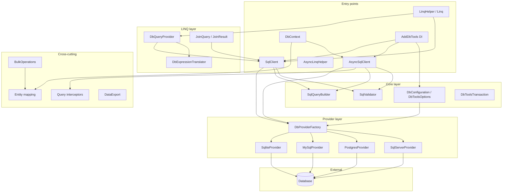

<!-- generated-by: gsd-doc-writer -->

# Architecture

## System overview

DBTools_SQL is a .NET 8 class library that provides multi-provider database access for SQL Server, PostgreSQL, MySQL, and SQLite. The library is organized as a layered architecture: configuration and dependency injection at the top, a provider-agnostic core built on `System.Data.Common` abstractions in the middle, and dialect-specific provider implementations at the bottom. Application code can interact through four primary surfaces—low-level CRUD via `SqlClient`/`AsyncSqlClient`, type-safe entity helpers via `LinqHelper<T>` and `Linq<T>`, async typed CRUD via `AsyncLinqHelper<T>`, or an EF-like unit-of-work pattern via `DbContext`—all sharing the same validation, query building, and provider resolution infrastructure.

Inputs are JSON configuration (`DBTools/config.json`, copied from `config.json.example`, or `DbToolsOptions`), connection strings, and strongly typed C# models or raw SQL fragments. Outputs are `DataView`/`DataTable` results, mapped entity collections, CSV exports, and boolean success indicators from mutation operations. Security is enforced centrally through parameterized queries and identifier validation before any SQL reaches the database.

## Component diagram



## Data flow

A typical read operation follows this path from application code to the database and back:

1. **Configuration resolution** — `DbConfiguration` loads `config.json` from the current working directory (copy from `DBTools/config.json.example` to `DBTools/config.json` for local development), or `DbToolsOptions` is supplied via `AddDbTools()`, resolves the `Provider` key, and builds a provider-specific connection string.
2. **Client construction** — `SqlClient` or `AsyncSqlClient` receives `IDbConfiguration`, `ISqlValidator`, `ISqlQueryBuilder`, and an `IDbProvider` from `DbProviderFactory`.
3. **Query construction** — The caller invokes a CRUD method, a `Linq<T>` property selector, or a deferred `DbQuery<T>` LINQ chain. `SqlValidator` validates table and column identifiers; `SqlQueryBuilder` or `DbExpressionTranslator` assembles parameterized SQL using the provider's dialect (quoting, paging, identity retrieval).
4. **Interceptor pipeline** (async path only) — `AsyncSqlClient` invokes registered `IQueryInterceptor` / `IAsyncQueryInterceptor` instances in `BeforeExecute`, allowing logging, audit trails, or soft-delete filter injection.
5. **Execution** — The client opens a `DbConnection` via `IDbProvider.CreateConnection()`, binds `DbParameter` instances, and executes the command through `System.Data.Common`.
6. **Result mapping** — Results return as `DataView`/`DataTable` for raw queries, or are projected into `TModel` instances via reflection in `LinqHelper<T>`/`Linq<T>`. `DbContext` routes tracked entities through `ChangeTracker` on `SaveChanges`.

A typical write operation (insert/update/delete) follows the same validation and provider path, with `IDbProvider.BuildUpsertSql()` generating dialect-specific MERGE, `ON CONFLICT`, or `ON DUPLICATE KEY` statements when upsert is requested.

**Dependency injection flow:**

```
Program.cs → services.AddDbTools(options) → DbProviderFactory.Create(provider)
          → singleton: ISqlValidator, ISqlQueryBuilder, IDbProvider, IDbConfiguration
          → scoped: IAsyncSqlClient (with interceptors), transient: SqlClient
          → injected into application services
```

## Key abstractions

| Abstraction | Location | Role |
|-------------|----------|------|
| `IDbProvider` | `DBTools/Abstractions/IDbProvider.cs` | Provider contract for connections, parameter prefixes, identifier quoting, paging, identity SQL, and upsert generation |
| `ISqlClient` | `DBTools/Abstractions/ISqlClient.cs` | Synchronous CRUD and query-builder surface implemented by `SqlClient` |
| `IAsyncSqlClient` | `DBTools/Abstractions/IAsyncSqlClient.cs` | Async CRUD with interceptor and transaction support, implemented by `AsyncSqlClient` |
| `IDbConfiguration` | `DBTools/Abstractions/IDbConfiguration.cs` | Connection settings and provider name; implemented by `DbConfiguration` and `OptionsDbConfiguration` |
| `ISqlValidator` | `DBTools/Abstractions/ISqlValidator.cs` | Identifier validation and SQL injection prevention; implemented by `SqlValidator` |
| `ISqlQueryBuilder` | `DBTools/Abstractions/ISqlQueryBuilder.cs` | Dynamic SQL generation from objects; implemented by `SqlQueryBuilder` |
| `IQueryInterceptor` | `DBTools/Abstractions/IQueryInterceptor.cs` | Cross-cutting query hooks (logging, audit, soft delete) with sync and async variants |
| `IDbTransaction` | `DBTools/Abstractions/IDbTransaction.cs` | Transaction scope; implemented by `DbToolsTransaction` |
| `DbProviderFactory` | `DBTools/Providers/DbProviderFactory.cs` | Resolves `IDbProvider` from `DatabaseProvider` enum or string name |
| `DbQueryProvider` | `DBTools/Linq/DbQueryProvider.cs` | `IQueryProvider` that translates LINQ expression trees to SQL via `DbExpressionTranslator` |
| `EntityMapping` | `DBTools/Mapping/EntityMapping.cs` | Resolved table/column metadata for `DbContext` and `BulkOperations` |
| `DbContext` | `DBTools/Context/DbContext.cs` | EF-like session with `DbSet<T>`, change tracking, and `SaveChanges` |

## Directory structure rationale

The solution contains two projects: the library (`DBTools/`) and its test suite (`DBToolsUnitTest/`). The library is organized by concern rather than by feature, so each namespace can be consumed independently.

```
DBTools_SQL/
├── DBTools/                    # Main NuGet package (net8.0)
│   ├── Abstractions/           # Public interfaces — stable contracts for DI and testing
│   ├── Configuration/            # Microsoft.Extensions.DependencyInjection registration
│   ├── Core/                     # Connection management, CRUD clients, validation, transactions
│   ├── Providers/                # Per-database dialect implementations (loaded via factory)
│   ├── Controllers/              # High-level entity helpers (LinqHelper, Linq, legacy controllers)
│   ├── Linq/                     # IQueryable infrastructure (expression translation, JOINs)
│   ├── Context/                  # DbContext, DbSet, ChangeTracker (unit-of-work pattern)
│   ├── Mapping/                  # Entity attributes, fluent config, mapping resolver
│   ├── Interceptors/             # Built-in query interceptors (logging, audit, soft delete)
│   ├── Bulk/                     # High-throughput bulk insert (SqlBulkCopy on SQL Server)
│   ├── Export/                   # CSV export and DataTable conversion utilities
│   └── Models/                   # GenericObject data-transfer containers for query building
├── DBToolsUnitTest/              # xUnit test project (unit + integration categories)
├── docs/                         # User-facing documentation (API reference, examples, security)
├── scripts/                      # SQL setup scripts for integration test databases
├── .github/workflows/            # CI (build/test) and release (NuGet publish) pipelines
└── docker-compose.yml            # SQL Server container for integration tests
```

**Design rationale by layer:**

- **Abstractions before implementations** — All public clients depend on interfaces (`ISqlClient`, `IDbProvider`, etc.), enabling mock-based unit tests and provider swapping without changing application code.
- **Providers isolated from core** — Dialect differences (bracket vs. backtick quoting, MERGE vs. ON CONFLICT upsert, identity retrieval) are encapsulated in four small classes under `Providers/`. Optional provider NuGet packages (Npgsql, MySqlConnector, Microsoft.Data.Sqlite) are loaded by the consuming application, not bundled transitively.
- **Controllers as convenience layer** — `LinqHelper<T>`, `Linq<T>`, and `AsyncLinqHelper<T>` wrap `SqlClient`/`AsyncSqlClient` with reflection-based mapping and expression parsing. They sit above Core rather than inside it, so callers who only need raw CRUD are not forced to adopt LINQ.
- **Linq as optional query engine** — `DbQueryProvider` and `DbExpressionTranslator` implement deferred `IQueryable` execution separately from the synchronous helper classes, keeping the expression-tree translation concern isolated.
- **Context for tracked workflows** — `DbContext`/`ChangeTracker` provide an opt-in EF-like pattern for applications that need change tracking and `SaveChanges`, without requiring the full Entity Framework dependency.
- **Interceptors at the async boundary** — Cross-cutting concerns hook into `AsyncSqlClient` execution, keeping the synchronous `SqlClient` path lightweight for legacy consumers.

## Related documentation

- [Quick Start](QUICKSTART.md) — installation and first queries
- [API Reference](API_REFERENCE.md) — method-level documentation
- [Examples](EXAMPLES.md) — end-to-end usage patterns
- [Security](SECURITY.md) — SQL injection prevention and validation rules
