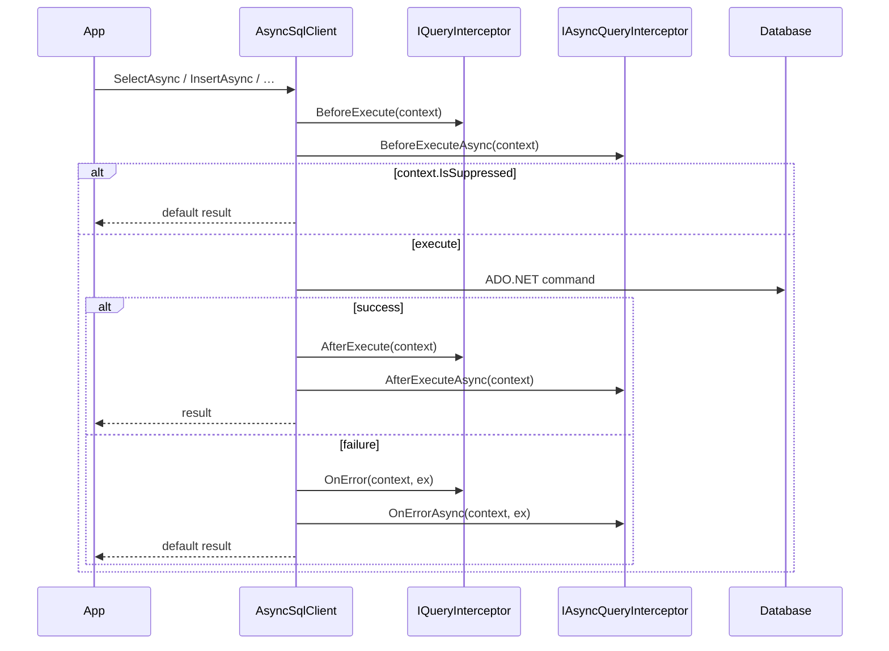

<!-- generated-by: gsd-doc-writer -->

# Query Interceptors

## Overview

Query interceptors are cross-cutting hooks that run around database operations in `AsyncSqlClient`. They let you add logging, audit trails, soft-delete filtering, caching, or other behavior without changing core client code. Interceptors receive a mutable `QueryInterceptionContext` with the SQL, parameters, operation type, and table name, and can modify the query before it executes or react to success or failure afterward.

Interceptors apply only to the **async execution path** (`AsyncSqlClient`). The synchronous `SqlClient` does not invoke interceptors. Transaction-scoped helpers such as `SelectAsync(DbToolsTransaction, …)` and `ExecuteInTransactionAsync` also bypass the interceptor pipeline.

---

## Interceptor lifecycle

Every intercepted operation follows the same three-phase pipeline inside `AsyncSqlClient`:

1. **BeforeExecute** — All sync interceptors run first (registration order), then all async interceptors. Interceptors may modify `context.Sql`, `context.Parameters`, or set `context.IsSuppressed` to skip execution.
2. **AfterExecute** — Called on success with `Duration` and `RowsAffected` populated.
3. **OnError** — Called when execution throws; the client still records the error in its `_error` property and returns a default result (`false`, empty `DataTable`, or `null`).



Sync interceptors always run before async interceptors within each phase. Register interceptors in the order you want them to execute.

---

## Key interfaces

### `IQueryInterceptor`

Location: `DBTools/Abstractions/IQueryInterceptor.cs`

| Method | When it runs | Typical use |
|--------|--------------|-------------|
| `BeforeExecute(QueryInterceptionContext context)` | Before the query hits the database | Modify SQL, stamp audit metadata, append filters |
| `AfterExecute(QueryInterceptionContext context)` | After successful execution | Log duration, write audit rows |
| `OnError(QueryInterceptionContext context, Exception exception)` | On execution failure | Error logging, alerting |

### `IAsyncQueryInterceptor`

Same three hooks with `*Async` variants and an optional `CancellationToken`. Use when `BeforeExecute` needs I/O (external audit service, distributed cache lookup).

### `QueryInterceptionContext`

Shared context object passed to every hook:

| Property | Description |
|----------|-------------|
| `Sql` | Query string; interceptors may rewrite it |
| `Parameters` | Parameter list; interceptors may add or replace values |
| `OperationType` | `Select`, `Insert`, `Update`, `Delete`, `Execute`, or `Scalar` |
| `TableName` | Target table when known (CRUD helpers set this) |
| `Duration` | Set after execution (`TimeSpan?`) |
| `RowsAffected` | Set after execution (`int?`) |
| `IsSuppressed` | When `true`, the client skips the database call |
| `Properties` | Arbitrary key/value bag for passing data from `BeforeExecute` to `AfterExecute` |

---

## Built-in interceptors

All built-in interceptors live in `DBTools/Interceptors/` and implement `IQueryInterceptor`.

### `LoggingInterceptor`

Logs every query before and after execution using a caller-supplied delegate.

```csharp
using DBTools.Interceptors;

options.AddInterceptor(new LoggingInterceptor(Console.WriteLine));
// With parameter values (disabled by default for security):
options.AddInterceptor(new LoggingInterceptor(msg => logger.LogInformation(msg), logParameters: true));
```

**BeforeExecute** output format: `[DBTools] Executing {OperationType}: {Sql}`  
**AfterExecute** output format: `[DBTools] Completed {OperationType} in {ms}ms | Rows: {n}`  
**OnError** output format: `[DBTools] ERROR {OperationType}: {message} | SQL: {Sql}`

Plug in any sink: `Console.WriteLine`, `ILogger.LogInformation`, Serilog, NLog, etc.

### `AuditInterceptor`

Records audit metadata on mutating operations. Does not rewrite SQL — audit columns are expected to be handled at the entity/model layer.

```csharp
options.AddInterceptor(new AuditInterceptor(
    getCurrentUser: () => httpContext.User.Identity?.Name ?? "system",
    createdAtColumn: "CreatedAt",
    updatedAtColumn: "UpdatedAt",
    createdByColumn: "CreatedBy",
    updatedByColumn: "UpdatedBy"));
```

On `Insert`, `Update`, or `Delete`, **BeforeExecute** sets:

- `context.Properties["AuditUser"]` — from `getCurrentUser()` or `"system"` when the delegate is null
- `context.Properties["AuditTimestamp"]` — `DateTime.UtcNow`

`AfterExecute` and `OnError` are no-ops by default but can be extended to write to an audit log table.

### `SoftDeleteInterceptor`

Transparently filters active records and converts hard deletes to soft deletes.

```csharp
options.AddInterceptor(new SoftDeleteInterceptor(
    columnName: "IsDeleted",
    activeValue: "0"));
```

| Operation | Behavior |
|-----------|----------|
| `Select` | Appends `AND {column} = {activeValue}` (or adds a `WHERE` clause if none exists), inserted before `ORDER BY` when present |
| `Delete` | Rewrites `DELETE FROM {table} WHERE …` to `UPDATE {table} SET {column} = 1 WHERE …` and changes `OperationType` to `Update` |

Ensure your schema uses the configured column and that `activeValue` matches your data type (the default `"0"` is embedded as a literal in SQL).

---

## Registering interceptors with dependency injection

### `AddDbTools()` and `DbToolsOptions`

`ServiceCollectionExtensions.AddDbTools` registers a scoped `IAsyncSqlClient`. When the client is resolved, every interceptor registered on `DbToolsOptions` is attached automatically:

```csharp
using DBTools.Configuration;
using DBTools.Interceptors;

services.AddDbTools(options =>
{
    options.ConnectionString = builder.Configuration.GetConnectionString("DefaultConnection");
    options.Provider = DatabaseProvider.SqlServer;

    options.AddInterceptor(new LoggingInterceptor(Console.WriteLine));
    options.AddInterceptor(new AuditInterceptor(() => "system"));
    options.AddInterceptor(new SoftDeleteInterceptor());
});
```

Registration flow:

1. `configure(options)` builds a `DbToolsOptions` singleton.
2. `options.AddInterceptor(...)` appends to internal `Interceptors` or `AsyncInterceptors` lists (fluent, returns `this`).
3. The `IAsyncSqlClient` factory creates an `AsyncSqlClient` and calls `client.AddInterceptor(...)` for each entry.

`DbContext` constructed with `DbToolsOptions` applies the same interceptors to its internal `AsyncSqlClient`.

### Direct registration on `AsyncSqlClient`

When not using DI, register interceptors on the client instance:

```csharp
var client = new AsyncSqlClient(config, validator, queryBuilder, provider);
client
    .AddInterceptor(new LoggingInterceptor(Console.WriteLine))
    .AddInterceptor(new SoftDeleteInterceptor());
```

`AddInterceptor` is fluent and accepts either `IQueryInterceptor` or `IAsyncQueryInterceptor`.

---

## Writing a custom interceptor

Example implementation (not included in the library — implement your own class following this pattern):

Implement `IQueryInterceptor` (and optionally `IAsyncQueryInterceptor` for async work):

```csharp
using DBTools.Abstractions;
using System;

public class TenantFilterInterceptor : IQueryInterceptor
{
    private readonly Func<int> _getTenantId;

    public TenantFilterInterceptor(Func<int> getTenantId) => _getTenantId = getTenantId;

    public void BeforeExecute(QueryInterceptionContext context)
    {
        if (context.OperationType != QueryOperationType.Select) return;

        var tenantId = _getTenantId();
        var clause = $"TenantId = {tenantId}";

        if (context.Sql.Contains("WHERE", StringComparison.OrdinalIgnoreCase))
            context.Sql += $" AND {clause}";
        else
            context.Sql += $" WHERE {clause}";
    }

    public void AfterExecute(QueryInterceptionContext context) { }

    public void OnError(QueryInterceptionContext context, Exception exception) { }
}
```

Register your custom interceptor via `options.AddInterceptor(new TenantFilterInterceptor(() => currentTenantId))` (using the example class above).

Guidelines:

- Modify `context.Sql` and `context.Parameters` in `BeforeExecute`, not private fields on the client.
- Use `context.Properties` to pass state from `BeforeExecute` to `AfterExecute`.
- Set `context.IsSuppressed = true` in a caching interceptor to skip the database round-trip.
- Complete all interceptor registration before sharing the client across threads; the internal lists are not thread-safe for concurrent `AddInterceptor` calls.

---

## Which operations are intercepted

| Method family | Intercepted |
|---------------|-------------|
| `SelectAsync`, `InsertAsync`, `UpdateAsync`, `DeleteAsync` | Yes |
| `ExecuteQueryAsync`, `ExecuteScalarAsync` | Yes |
| `SelectAsync(DbToolsTransaction, …)`, `ExecuteInTransactionAsync` | No |
| `SqlClient` (sync) | No |

---

## Related documentation

- [CONFIGURATION.md](CONFIGURATION.md) — `DbToolsOptions` properties and `AddDbTools` overloads
- [ARCHITECTURE.md](ARCHITECTURE.md) — how interceptors fit in the overall pipeline
- [API_REFERENCE.md](API_REFERENCE.md) — `AddDbTools`, `DbToolsOptions.AddInterceptor`, and client method signatures
